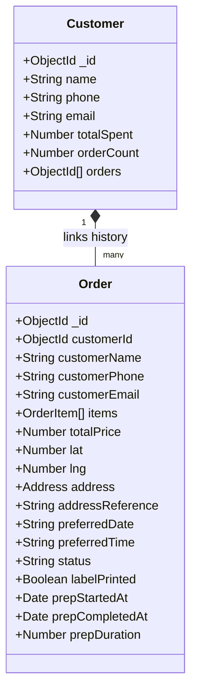

# Database & Administrative Portal Guide

This guide describes how to configure the MongoDB database integration, explains the CRM customer de-duplication workflow, outlines the Kitchen Display System (KDS) timer design, and documents the Courier Nearest Neighbor route optimization.

---

## 1. MongoDB Installation & Environment Configuration

To enable database persistence for order submissions and dashboard tracking, you must supply a MongoDB connection string.

### Option A: Local MongoDB Community Server
1. Download and run [MongoDB Community Server](https://www.mongodb.com/try/download/community) locally.
2. The default connection URI is usually:
   ```env
   MONGODB_URI=mongodb://localhost:27017/golden-crumb
   ```

### Option B: MongoDB Atlas (Cloud Hosted)
1. Sign up for a free tier at [MongoDB Atlas](https://www.mongodb.com/cloud/atlas).
2. Create a shared cluster and select the **Connect your application** option under Database Deployments.
3. Copy the generated application link and replace `<password>` with your database user password.

### Project Setup
Create or update your local `.env.local` file at the root of the project:
```env
MONGODB_URI=mongodb+srv://<username>:<password>@cluster0.mongodb.net/golden-crumb?retryWrites=true&w=majority
```
*Note: `.env.local` is automatically ignored by Git to secure database credentials.*

---

## 2. Mongoose Schemas & Relationships

The database layer uses three core Mongoose models located inside `src/models/`:



1. **`User` (`src/models/User.ts`)**: Represents administrator or staff profiles. Includes authorization roles: `admin`, `kitchen`, and `courier`.
2. **`Customer` (`src/models/Customer.ts`)**: Stores lifetime customer totals, profile summaries, and links to their historical orders.
3. **`Order` (`src/models/Order.ts`)**: Stores client details, products ordered, price totals, address details, geo-coordinates, preparation timestamps, and printing flags.

---

## 3. CRM De-duplication Workflow
a
To prevent client profiles from splitting across repeat checkouts, a cascade matching algorithm is executed during order submissions in `src/app/actions/dbActions.ts` (`createOrderAction`):

1. **String Normalization**:
   * **Emails**: Trimmed and lowercased.
   * **Phones**: Stripped of all non-digit characters (`(555) 123-4567` -> `5551234567`).
   * **Names**: Trimmed, lowercased, and collapsed of duplicate whitespace.
2. **Cascading Profile Association**:
   * Search for an existing customer matching the normalized **Email** OR normalized **Phone** OR normalized **Name**.
   * If a match occurs, the order is associated with that customer. Their contacts are updated with the latest checkout information, their order count increases, and their cumulative spend adds the new order total.
   * If no match occurs, a new Customer profile is registered.

---

## 4. Kitchen Display System (KDS) & Timer Features

The KDS screen dynamically renders pending orders requiring kitchen preparation.

* **Live Prep Timer**: When staff clicks **Start Baking**, the order transitions to `kitchen_prep` and sets the `prepStartedAt` timestamp. A client-side React tick hook (`setInterval`) calculates the difference in seconds.
* **Duration Warning Alert**: If preparation duration exceeds 5 minutes (300 seconds), the timer pulses red to alert staff of baking delays.
* **Print Shipping Label**: Opens a print-preview layout modal modeled after a shipping package sticker containing landmarks and a CSS barcode. Printing it sends a database call setting `labelPrinted: true`.

---

## 5. Courier Nearest Neighbor Route Sequencing

To organize today's routes efficiently, the `getTodayDeliveries()` server action runs a Nearest Neighbor sequencing algorithm:

1. **Starting Point**: Starts at the Golden Crumb Bakery kitchen coordinates (`37.7749`, `-122.4194`).
2. **Distance Calculations**: Uses the **Haversine formula** to measure precise spherical distances in meters between delivery addresses.
3. **Optimized Path Sorting**:
   * Loops through active unvisited orders, selecting the one closest to the current point.
   * Adds the order to the delivery route sequence.
   * Relocates the cursor reference to that order's destination pin.
   * Repeats until all stops are sequenced.
4. **Visual Mapping**: The client-side Leaflet component processes this sequence, mapping numbered pins (`1`, `2`, `3`) along with popups, connected by dashed polyline vectors.
